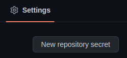

# ex_hugo
exercise for hugo site generator

# env
- 以 klakegg/hugo 的 image 作為dev container 就可以

# create project
```shell
hugo new site ex_hugo --force
# 下載相關 theme https://themes.gohugo.io/
cd yubinBlog
git submodule add https://github.com/onweru/compose.git themes/compose
# 新增 theme settings in config.toml
# 新增文章
hugo new posts/test-hugo.md
# 跑起來
hugo server -D
```

# 放到 git hub 的相關設定
- 先建立一個 github 的 access token [github](https://github.com/settings/tokens/new)，只要開repo 部份就可以，如下圖

- 建立 `.github/workflows/gh-pages.yml` 

# pages
- 在 github 的[測試站](https://wyubin.github.io/ex_hugo/)

# git-action
- 可以試著去看相關 github action 來確認是不是可以改看看 https://github.com/peaceiris/actions-gh-pages
